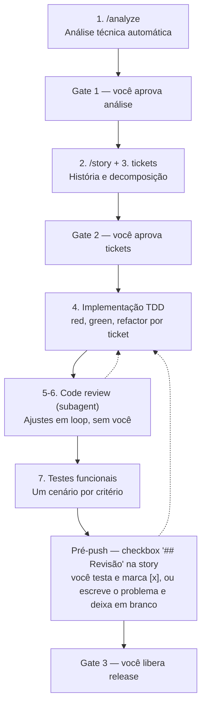

# Fluxo de trabalho — desenvolvimento e publicação

> Fluxo completo do projeto (XP/TDD, análise, tickets, code review automatizado, testes funcionais, branches, CI, release).
> Referenciado pelo `CLAUDE.md` e lido no início da sessão (hook `session-start`).

O desenvolvimento segue **XP (Extreme Programming)** com **TDD red → green → refactor**, com **3 gates humanos** (+ 1 pausa fixa pré-push, ver abaixo) — o resto do ciclo roda sozinho:

- O **navigator** (usuário) aprova a análise, aprova a história (com seus tickets e testes funcionais), testa a branch antes do push e libera o release.
- O **driver** (Claude) investiga, planeja, implementa, revisa (via subagent) e publica — sem interromper o navigator entre os gates, exceto pela pausa pré-push.



> ⚠️ **`master` e `develop` são protegidos.** Push direto é bloqueado em ambos. Features entram via PR para `develop`; o PR `develop → master` acontece apenas no momento de release. Nunca commite ou force-push diretamente em nenhum dos dois.

### Gates humanos (únicos pontos de interação do navigator)

| Gate | Onde | O que o navigator faz |
|------|------|------------------------|
| **G1 — Análise aprovada** | `work_progress/analysis/*.md` → `[x] Análise aprovada` | Aprova a *direção* (problema + solução escolhida) |
| **G2 — História revisada** | `work_progress/stories/*.md` → `[x] História revisada` | Aprova story **e tickets** (e os cenários funcionais) de uma vez |
| **Pré-push** | `work_progress/stories/*.md`, seção `## Revisão` → `[x] Pré-push: revisado e aprovado` | Testa a história (manualmente, na branch) e marca o checkbox pra liberar o push — sem marcar, **push-pr.sh não roda, nunca** |
| **G3 — Release** | `/release-pr` + aprovação do PR develop→master | Libera o corte de release |

**Tudo entre G2 e G3 roda sozinho:** implementação, code review (subagent), ajustes, testes funcionais, commit. Duas exceções: o *circuit breaker* do code review (3 iterações sem `APPROVED` num ticket escalam ao navigator) e a **pausa antes de `push-pr.sh`** — regra permanente (não específica de uma história): o driver nunca dá push/abre PR sem o navigator ter testado a branch e aprovado explicitamente primeiro. Commits por ticket continuam automáticos; só o `push-pr.sh` final espera esse ok.

### Estratégia de branches

```
master   ← PRs de release (develop → master)
  ↑
develop  ← PRs de feature/fix/chore
  ↑
feat/xyz · fix/abc · chore/def  ← branches de história
```

- Branches de história partem **sempre de `develop`**: `git checkout -b <tipo>/<desc> develop`
- PRs de história têm **`develop` como base**: `gh pr create --base develop`
- PRs de release têm **`master` como base**: `gh pr create --base master --head develop`
- **Ciclo de vida da branch:** deletada imediatamente após o merge em `develop` — remoto automaticamente pelo GitHub, local com `git branch -d <branch>` no passo de merge em lote.

### CI e branch protection

Todo PR para `master` ou `develop` dispara `.github/workflows/ci.yml` com dois jobs paralelos:
- **Backend**: `go test ./...` + `go build ./...`
- **Frontend**: `yarn lint` + `yarn test --run` + `yarn build`

Ambos os branches estão protegidos: push direto bloqueado, PR obrigatório, checks `Backend` e `Frontend` obrigatórios. `master` exige 1 aprovação humana; `develop` não exige aprovação (projeto solo — CI já é a barreira de qualidade). Para reaplicar as regras (ex: em novo repositório):

```bash
# master — só aceita PRs vindos de develop (releases); exige 1 aprovação humana
gh api repos/{owner}/{repo}/branches/master/protection \
  --method PUT \
  --header "Accept: application/vnd.github+json" \
  --input - <<'EOF'
{
  "required_status_checks": { "strict": true, "contexts": ["Backend", "Frontend"] },
  "enforce_admins": true,
  "required_pull_request_reviews": { "dismiss_stale_reviews": true, "required_approving_review_count": 1 },
  "restrictions": null
}
EOF

# develop — aceita PRs de feature branches; CI obrigatório, sem aprovação humana
gh api repos/{owner}/{repo}/branches/develop/protection \
  --method PUT \
  --header "Accept: application/vnd.github+json" \
  --input - <<'EOF'
{
  "required_status_checks": { "strict": true, "contexts": ["Backend", "Frontend"] },
  "enforce_admins": false,
  "required_pull_request_reviews": { "dismiss_stale_reviews": true, "required_approving_review_count": 0 },
  "restrictions": null
}
EOF
```

### Fluxo por demanda

> ⚠️ **OBRIGATÓRIO:** Antes de escrever qualquer linha de código ou teste, o driver DEVE passar por `/analyze` (quando a demanda tiver trade-offs reais) e por `/story` (story file revisada no G2, branch só depois). Sem exceção — nem para bugs simples, nem para "pequenas correções" (nesses casos a análise pode ser breve, mas existe).

```
demanda livre
   │
   ▼
/analyze ──► work_progress/analysis/YYYYMMDDHHmm_<slug>.md
   │              (problema, opções, decisão, impacto)
   ▼
[G1] navigator marca [x] Análise aprovada        ◄── scripts/await-gate.sh analise
   │
   ▼
/story ──► work_progress/stories/YYYYMMDDHHmm_<slug>.md   (ainda em develop, sem branch)
   │         story JÁ decomposta em tickets T1..Tn
   │         + 1 teste nomeado por critério na suíte permanente correspondente
   ▼
[G2] navigator marca [x] História revisada       ◄── scripts/await-gate.sh revisao
   │
   ▼
git checkout -b <tipo>/<slug> develop   (branch só nasce AGORA, pós-G2)
   │
   ▼  (loop por ticket, sem interação)
┌─────────────────────────────────────────────┐
│ para cada ticket Tn:                         │
│   red → green → refactor (TDD)               │
│   bash scripts/check.sh                      │
│   invoca subagent code-reviewer              │
│   ├─ CHANGES_REQUESTED → corrige → re-invoca │
│   │   (máx. 3 iterações; estoura → escala    │
│   │    ao navigator)                         │
│   └─ APPROVED → scripts/record-review.sh Tn  │
└─────────────────────────────────────────────┘
   │
   ▼
bash scripts/functional-check.sh   → roda cenários, marca CAs [x]
bash scripts/finalize-story.sh     → se tudo verde: marca [x] Aprovado
   │
   ▼
scripts/commit.sh (se pendente)
   │
   ▼
Preenche o resumo em `## Revisão` da story
   │
   ▼
bash scripts/await-gate.sh prepush   (background — mesmo padrão de G1/G2)
   │
   ▼
[Pré-push] navigator testa a branch, marca `[x] Pré-push: revisado e aprovado`
           (ou escreve os problemas encontrados em `## Revisão` e deixa desmarcado —
           o driver lê, corrige, atualiza o resumo e volta a aguardar o MESMO checkbox)
   │        ◄── PARE aqui: push-pr.sh NUNCA roda sem esse checkbox marcado
   ▼
scripts/push-pr.sh   (push+PR+CI+merge)
   │
   ▼
[G3] /release-pr quando o navigator liberar (inalterado)
```

1. **`/analyze <demanda>`** investiga o código (nunca pergunta o que o código já responde), resolve ambiguidade genuína via `AskUserQuestion` **antes** de escrever, e produz `work_progress/analysis/YYYYMMDDHHmm_<slug>.md` (Problema/Investigação/Opções/Decisão recomendada/Impacto). Roda `scripts/await-gate.sh analise <arquivo>` em background e, ao abrir, segue direto para `/story` — sem perguntar nada. **Depois que `[x] Análise aprovada` abre, a análise está congelada:** o próximo artefato que o driver toca é a story, nunca mais a análise — nenhuma elaboração adicional pertence a ela; qualquer contexto extra vai pro Contexto/Solução da story.
2. **`/story [análise|descrição livre]`** escreve a story **completa** (Contexto/Solução nunca em branco) **já decomposta em tickets** — ver estrutura abaixo — e escreve os **cenários funcionais agora** (antes do G2, para o navigator revisar junto), tudo ainda em `develop` — **sem criar branch nenhuma** (`work_progress/stories/` é gitignored; os cenários funcionais ficam untracked até o commit do 1º ticket). Roda `scripts/await-gate.sh revisao` em background. **TDD (red phase) só começa depois que a story existe** — "existe" quer dizer o arquivo `work_progress/stories/*.md` já **salvo em disco**, com Tickets/CAs escritos, não só decidido/investigado na cabeça do driver: nenhum arquivo de teste é tocado (nem `Write`/`Edit`) antes desse arquivo ser criado, mesmo que a investigação prévia já tenha determinado exatamente quais testes escrever. Isso vale tanto pro fluxo normal (`/analyze` → G1 → `/story`) quanto pra tickets novos adicionados depois de G2 já ter passado (ex.: feedback de pré-push virando T5/T6/...): o texto do ticket na story vem ANTES do teste vermelho correspondente, sempre — nunca o inverso.
3. **Gate G2.** Nenhuma branch nova, linha de código de produção ou teste antes de `[x] História revisada` — evita o custo de abandonar uma branch se a revisão pedir mudanças grandes na story.
4. **Só então:** `git checkout -b <tipo>/<slug> develop` (sincronizado de novo, caso a revisão tenha demorado).
5. **Ciclo por ticket (sem nenhum prompt ao navigator):** TDD red → green → refactor → `bash scripts/check.sh` → invoca o subagent `code-reviewer` → `CHANGES_REQUESTED` (corrige blocker/major, re-invoca, máx. 3 iterações, senão escala) ou `APPROVED` (`scripts/record-review.sh <Tn> <iterações>`, então commit do ticket).
6. **Fim dos tickets:** `bash scripts/functional-check.sh` (roda os cenários, marca os CAs) → `bash scripts/finalize-story.sh` (marca `[x] Aprovado` quando História revisada + Review APPROVED + todos os CAs estão verdes) → `scripts/commit.sh` (se houver algo pendente) → preenche o resumo em `## Revisão` da story → `bash scripts/await-gate.sh prepush` em background (mesmo padrão de G1/G2) → **PARA e aguarda o navigator marcar `[x] Pré-push: revisado e aprovado`** (ver "Pré-push" em Gates humanos e em Artefatos acima) → só então `scripts/push-pr.sh` (push + PR **sempre `--base develop`** + aguarda CI + merge quando verde). Se o navigator encontrar problemas em vez de aprovar, ele escreve o que encontrou na própria seção `## Revisão` e **deixa o checkbox desmarcado** — o driver lê o feedback (aparece no diff do arquivo), corrige (voltando ao ciclo normal de ticket — TDD → `check.sh` → subagent `code-reviewer` → commit — se a correção mexer em lógica de produção), atualiza o resumo e volta a aguardar o MESMO checkbox. **CI vermelho:** o `push-pr.sh` propaga o erro sem mergear (PR fica aberto) — **Política A**: um fix trivial pós-`Aprovado` (deixar o CI verde) não exige nova aprovação; se o fix mexer em lógica de produção, volta pro ciclo de ticket (novo review do subagent).
7. Atualizar o arquivo de release correspondente em `work_progress/releases/`: preencher a branch e o número do PR na tabela, marcar `[~]`; o `merge-when-green.sh` marca `[~]→[✓]` ao mergear em `develop`. **Apenas o corte de release** (`develop → master`, G3) depende de autorização explícita do navigator.

### Artefatos

#### `work_progress/analysis/YYYYMMDDHHmm_<slug>.md` (gitignored, como `work_progress/stories/`)

```markdown
# Análise — <título curto>

## Problema
## Investigação
(arquivos relevantes, comportamento atual, causa raiz)
## Opções
1. ... (prós/contras)
2. ...
## Decisão recomendada
## Impacto
(módulos afetados, riscos, migrações, estimativa de decomposição em tickets)

## Gate
- [] Análise aprovada
```

#### `work_progress/stories/YYYYMMDDHHmm_<slug>.md`

```markdown
# tipo(escopo): descrição curta em inglês

> Análise: work_progress/analysis/YYYYMMDDHHmm_<slug>.md

## Contexto
## Solução

## Tickets
| # | Descrição | Depende de | Status |
|---|-----------|------------|--------|
| T1 | ... | — | [] |
| T2 | ... | T1 | [] |

### T1 — título
Escopo, arquivos, abordagem. Critérios cobertos: CA2.

## Critérios de Aceitação
- [] CA1: Backend e frontend verdes (auto: scripts/check.sh)
- [] CA2: <critério> (auto: scripts/check.sh)
- [] CA3: <critério> (auto: <comando que roda a suíte/script que prova o critério>)

## Gates
- [] História revisada
- [] Review: APPROVED
- [] Aprovado

## Code Review
(preenchido por scripts/record-review.sh)

## Revisão
(resumo do driver ao final, como hoje)

- [] Pré-push: revisado e aprovado
```

O checkbox `Pré-push: revisado e aprovado` é o gate da pausa pré-push (ver
"Gates humanos" acima) — **nunca marcado pelo driver**, só pelo navigator,
depois de testar a branch de verdade. Monitorado via `scripts/await-gate.sh
prepush` exatamente como os outros gates (G1/G2). Se o navigator encontrar
problemas em vez de aprovar, escreve o que encontrou ali mesmo (na própria
seção `## Revisão`, substituindo/complementando o resumo do driver) e
**deixa o checkbox desmarcado** — o driver lê o feedback (aparece no diff
do arquivo), corrige (voltando ao ciclo normal de ticket se a correção
mexer em lógica de produção) e atualiza o resumo, aguardando de novo o
mesmo checkbox. **`push-pr.sh` nunca roda sem esse checkbox marcado** —
regra permanente, sem exceção.

Regras:
- **Todo critério de aceite é verificado por um teste nomeado dentro da suíte permanente correspondente** (convenção completa por linguagem/suíte em "Testes funcionais" abaixo). Escrito pelo driver **antes** do G2 — o navigator revisa os testes junto com a story. CA1 é sempre `(auto: scripts/check.sh)`; os demais anotam `(auto: <comando>)` com o comando que roda a suíte/script onde o teste nomeado vive — o code review confirma que o teste existe e corresponde ao critério.
- `[x] Review: APPROVED` só é escrito por `record-review.sh` (todos os tickets aprovados pelo subagent).
- `[x] Aprovado` só é escrito por `finalize-story.sh` (nunca pelo driver à mão) quando: História revisada ✓ + Review APPROVED ✓ + todos os CAs ✓. Isso mantém `commit.sh`/`push-pr.sh`/hooks funcionando sem alteração de contrato.
- `[x] Pré-push: revisado e aprovado` — único gate cujo checkbox não é preenchido por nenhum script (ver acima).

Histórias e análises ficam em `work_progress/stories/`/`work_progress/analysis/` (subdiretórios do diretório único `work_progress/`, gitignored — ver `CLAUDE.md`). O nome do arquivo usa timestamp no formato `YYYYMMDDHHmm_<descricao>.md` — igual às migrations de banco — garantindo ordenação cronológica natural ao listar o diretório.

### Tickets

- Vivem **dentro da story** (não são GitHub Issues): projeto solo, o release file já dá a visão agregada; Issues adicionariam latência e estado duplicado.
- Um ticket = uma unidade implementável com TDD próprio, idealmente ≤ ~200 linhas de diff. Cada ticket vira **um commit** na branch da história (mensagem: `tipo(escopo): T1 — descrição`); o PR continua um por história.
- Se durante a implementação um ticket se revelar maior que o previsto, o driver o divide (T2 → T2a/T2b) atualizando a tabela — sem novo gate.
- Uma história com 1 ticket é válida; com mais de ~6, questione se não são duas histórias.

### Code review automatizado

Subagent `code-reviewer` (`.claude/agents/code-reviewer.md`): contexto limpo, lê o diff do ticket + arquivos tocados, devolve veredito estruturado. Nunca edita arquivos (`disallowedTools: Write, Edit`) nem marca checkboxes.

**Restrição de comando é aplicada por hook, não pelo `tools:` do frontmatter.** `Bash(git diff:*)`/`Bash(bash scripts/check.sh)` — a sintaxe de padrão por comando — **não existe na plataforma**: é ignorada silenciosamente e concede `Bash` irrestrito (achado real, confirmado inspecionando o transcript de uma review: rodou `docker run`, `find /`, `nohup npx vite`, `sed -i`, `kill`, tudo fora da lista documentada, só porque nada tecnicamente barrava). A restrição de verdade é `hooks.PreToolUse` no próprio frontmatter do agente, apontando pra `scripts/hooks/reviewer-bash-guard.sh` — só permite `git diff`, `git log`, `bash scripts/check.sh` (sem argumento) e `bash scripts/e2e-spec-check.sh <spec>`, com checagem de metacaractere de shell (`;|&`$<>\`) pra impedir injeção via argumento (ex. `bash scripts/check.sh; rm -rf /`).

**O code-reviewer nunca escreve nem improvisa verificação empírica** (harness próprio, `yarn dev`, Playwright/browser ad-hoc) — isso sempre foi o **driver**, nunca o reviewer. Quando um ticket mexe em algo com risco real de timing/DOM (portal, foco, scroll, posicionamento — a classe de bug que só se manifesta em browser real, não no jsdom dos testes de componente), o driver escreve um spec Playwright **permanente** em `e2e/tests/` como parte do próprio TDD do ticket (mesma suíte usada pro CA e2e, ver "Testes funcionais" abaixo); o reviewer só roda `bash scripts/e2e-spec-check.sh <spec>` (reusa o profile `development`, ver mais abaixo — não paga build/seed do zero) e lê o resultado. Se o reviewer julgar que falta essa cobertura, o achado é `major`: "cobertura empírica ausente para \<cenário\>" — nunca ele mesmo criando a verificação.

Loop por ticket:
1. Driver termina o TDD do ticket e roda `bash scripts/check.sh`.
2. Driver invoca o subagent passando: story, ticket, `git diff` staged/HEAD.
3. Veredito `CHANGES_REQUESTED` → driver corrige apenas issues `blocker` e `major` (registra `minor`/`nit` na seção Code Review como follow-up) e re-invoca.
4. Veredito `APPROVED` → `scripts/record-review.sh <Tn> <iterações>`.
5. **Circuit breaker:** 3 iterações sem `APPROVED` → driver para, resume o impasse na seção Code Review e escala ao navigator (única exceção de interação entre G2 e G3).

### Commits semânticos

Formato: `<tipo>(<escopo opcional>): <descrição curta em inglês>` — para tickets, `<tipo>(<escopo>): Tn — <descrição>`.

| Tipo | Quando usar |
|---|---|
| `feat` | nova funcionalidade |
| `fix` | correção de bug |
| `refactor` | refatoração sem mudança de comportamento |
| `test` | adição ou correção de testes |
| `docs` | documentação |
| `chore` | configuração, build, dependências |

### Testes funcionais

- **Regra única, sem exceção: todo CA é verificado por um teste nomeado dentro da suíte permanente correspondente — nunca um script `.sh` avulso dedicado a um único CA.** Não existe mais `tests/functional/caNN_<slug>.sh` (mecanismo eliminado na história `refactor/eliminar-scripts-sh-ca` — os últimos usos genuinamente não-unitários, retenção/e2e/PDF report, viraram testes nomeados ou scripts permanentes reusáveis, ver abaixo). A garantia real do critério é o teste existir com o nome/estrutura certa E a suíte estar verde — verificável por code review, não por script dedicado. Convenção por suíte:
  - **Quando um CA exige e2e (`e2e/tests/*.spec.ts`) em vez de — ou além de — teste de componente frontend:** um teste de componente (`*.test.tsx`) mocka fetch/router/libs de terceiros; isso o torna cego pra qualquer comportamento que só existe quando essa camada mockada roda de verdade. Critério prático: **se o teste do CA precisaria mockar a própria coisa que o CA afirma, é sinal de que é e2e, não componente.** Dois casos concretos: (a) comportamento visual/layout real (espaçamento, alinhamento, qualquer coisa que só existe com DOM/CSS/lib de terceiros renderizando de verdade — um `containerPadding` default de uma lib de grid, por exemplo, é invisível pra um teste que mocka essa lib); (b) fluxo cruzando fronteiras que os mocks escondem por definição (login real, navegação entre páginas, WebRTC/HLS conectando de fato). Fora desses dois casos, teste de componente continua sendo a opção default (mais rápido, mais barato de manter).
  - **Frontend**: `describe('CAn: <critério>', () => it('<comportamento>', ...))` dentro de um `*.test.tsx`/`.test.ts`. `(auto: scripts/check.sh)`. Rodar um CA isolado localmente: `yarn test -t 'CAn:'` (ou `scripts/frontend-check.sh <arquivo>` pro arquivo inteiro).
  - **Backend Go**: subtestes aninhados via `t.Run`, mapeando história → CA → cenário — `func TestNomeDaHistoria(t *testing.T) { t.Run("CAn: <critério>", func(t *testing.T) { t.Run("<comportamento>", func(t *testing.T) { ... }) }) }`. `(auto: scripts/check.sh)`. Rodar um CA isolado: `go test -run 'TestNomeDaHistoria/CAn' ./pkg/...` (cada nível do path do `-run` casa uma regex contra o nível correspondente da árvore de subtestes; bastam os primeiros níveis — `go test` já roda tudo abaixo do prefixo casado. A suíte inteira falha nativamente se o padrão não casar nenhum subteste — `go test` nunca passa em silêncio quando o `TestNomeDaHistoria` não existe).
  - **Backend Python (`services/yolo/`)**: função nomeada `def test_caN_<comportamento>(): ...` (prefixo `test_caN_` greppável, mesmo espírito do `t.Run`/`describe`). `(auto: scripts/check.sh)`. Rodar um CA isolado: `pytest -k caN` (via `scripts/yolo-check.sh <args>`: `bash scripts/yolo-check.sh -k caN`).
  - **e2e (`e2e/`, TypeScript/bun)**: dois casos, conforme o momento em que o comportamento existe —
    - Estrutural/estático (código-fonte, config, wiring — não precisa do harness Docker rodando): `describe`/`test` via **`bun:test`** (runner nativo do bun, `import { describe, test, expect } from 'bun:test'`), num arquivo `*.test.ts` fora de `e2e/tests/` (que é só pro Playwright — `testDir: './tests'` em `playwright.config.ts`). Requer `bun-types` em `devDependencies` + `"bun-types"` no array `types` do `tsconfig.json` (senão `tsc` não reconhece `bun:test`/`import.meta.dir`). Rodado por `scripts/e2e-lint-check.sh` (chamado condicionalmente por `check.sh` quando `e2e/` muda) — `(auto: scripts/check.sh)`. Exemplo: `e2e/reporters/pdf-reporter.test.ts`.
    - Comportamento que só existe **depois que a suíte Playwright inteira termina** (ex.: conteúdo de um relatório/artefato gerado no `onEnd()` de um reporter) não pode virar `test()` dentro de `e2e/tests/*.spec.ts` — inspecionaria o artefato da própria suíte ainda em execução. Vira uma checagem nomeada dentro de um **script permanente e reusável** em `scripts/` (não descartável, não dedicado a um único CA — mesma categoria de `check.sh`/`e2e.sh`/`frontend-check.sh`), anotado com o comando exato que o roda — `(auto: <comando>)`, ex.: `(auto: E2E_PDF_REPORT=on bash scripts/e2e-pdf-report-check.sh)`. Exemplo: `scripts/e2e-pdf-report-check.sh`.
  - **Infra/wiring que já é exercitado por uma suíte permanente existente** (ex.: o harness Docker do e2e já sobe em todo PR via o job `e2e` do CI) não precisa de CA/teste dedicado nenhum — é coberto pela suíte geral (CA1) e por code review, como qualquer mudança mecânica.
  - **Iterar num spec e2e sem pagar build+seed+install do zero a cada vez:** `docker-compose.yml` (raiz) inclui `e2e/docker-compose.yml` via `include:` e sobrescreve `e2e-camera`/`e2e-playwright` com `profiles: [development]` (opt-in, mesmo profile de `dev-camera`) — `e2e-playwright` troca o `command:` one-shot original (usado só por `scripts/e2e.sh`/CI) por um keep-alive (instala deps+Chromium uma vez, fica idle), permitindo `docker compose --profile development exec e2e-playwright bunx playwright test <arquivo>` repetidamente sem reinstalar nada. `scripts/e2e.sh`/CI continuam intocados (suíte completa, one-shot, `-f e2e/docker-compose.yml` direto). Topologia validada por `scripts/compose-check.sh` (ver tabela abaixo). **Suba com `--profile development up -d --wait`** antes do 1º `exec` (ou espere `docker compose ps` mostrar `(healthy)`) — o `healthcheck:` do `e2e-playwright` só fica `healthy` depois que `bun install`+`playwright install` terminam; um `exec` disparado antes disso falha. `scripts/e2e-spec-check.sh <spec>` embrulha esse mesmo mecanismo (`up -d --wait` + `exec ... playwright test --reporter=list <spec>`, forçando o reporter `list` já que o default configurado localmente pode ser `html`, que não imprime nada no stdout) numa invocação estática de 1 comando — usado pelo `code-reviewer` (ver "Code review automatizado" acima) e disponível pro driver também.

  Existe porque um script `.sh` dedicado por CA só reproduzia o mesmo `<runner> -k/-t/-run '<padrão>'` + verificação de "achou e passou" (workaround pro test runner não falhar quando o padrão não casa nada) repetido a cada CA — trabalho e arquivo redundantes quando o próprio nome do teste já é o cenário funcional, e pior: um script write-once nunca mais roda depois que a história que o criou fecha (`functional-check.sh` só o invocava durante o próprio ciclo da história), enquanto um teste na suíte nativa roda em TODO PR futuro. Convenção adotada nas histórias `refactor/frontend-testes-ca-describe` (origem — só frontend), generalizada pra Go/Python em `fix/fine-tuning-yolo-gpu`, e estendida a e2e/infra (eliminando o mecanismo de script dedicado por completo) em `refactor/eliminar-scripts-sh-ca`.
- `scripts/functional-check.sh`: roda `check.sh` (marca CA1) e depois, pra cada comando **único** anotado `(auto: <comando>)` na story (exceto `scripts/check.sh`, já coberto acima), roda esse comando uma vez e marca `[x]` todo CA que o referencia exatamente. Falhou → esses CAs ficam `[]` e o script sai com erro (driver corrige e re-roda; se a correção mexer em lógica, o ticket volta ao loop de review).
- Substitui o antigo `story-approval.sh` interativo: critério verificável por máquina é marcado pela máquina. Critério genuinamente não-automatizável deve ser questionado no G1/G2 — ou vira automatizável, ou não é critério.

### Slash commands

O fluxo acima é automatizado pelos slash commands em `.claude/commands/`:

| Comando | O que faz |
|---|---|
| `/analyze <demanda livre>` | Investiga e produz `work_progress/analysis/*.md`; aguarda o gate G1. |
| `/story [análise\|descrição livre]` | Cria story decomposta em tickets (ainda em `develop`, sem branch); aguarda o gate G2; após G2, cria a branch a partir de `develop` e roda o ciclo completo até parar pra você testar e aprovar o push (`push-pr.sh` só roda depois desse ok). |
| `/release-pr [vX.Y.Z]` | Valida release file e abre PR develop → master (após todas as histórias `[✓]`). |
| `/release-tag` | Roda `./scripts/release.sh` em master após o PR de release ser mergeado. |

Use os commands em vez de executar os passos manualmente — eles validam pré-condições e evitam erros (branch errada, working tree suja, status incompleto).

### Hooks de pre-commit (`.claude/settings.json`)

Hooks `PreToolUse` (matcher `Bash`, versionados no repo) impõem o fluxo automaticamente. O `settings.json` só **chama scripts** versionados em `scripts/hooks/` (a lógica vive lá, não inline):

| Gate | Script | Bloqueia quando |
|---|---|---|
| Aprovação por ticket | `scripts/hooks/story-approved.sh` | `git commit` em branch de história sem `[x] História revisada`, ou quando o nº de commits já feitos na branch ≥ nº de tickets com `APPROVED` registrado (modo legado: libera tudo se `[x] Aprovado` já estiver marcado). |
| Target do PR | `scripts/hooks/pr-target.sh` | `gh pr create --base master` a partir de branch que não seja `develop`/`release/*`. |
| Testes backend | `scripts/hooks/precommit-tests.sh` | `git commit` quando `go build ./...` ou `go test -count=1 ./...` falham. |

O gate de testes roda no host (Go instalado), **sem cache** (`-count=1`) — só execução limpa pega testes dependentes de `time.Now()` (o cache do Go não rastreia o relógio). Escopo é backend; o frontend segue coberto pelo CI. Hooks só recarregam no início da sessão do Claude Code: alterações em `settings.json` (ou nos scripts de hook) valem a partir da próxima sessão.

**Hook escopado a um subagent** (diferente dos acima, que valem pra sessão principal inteira): `.claude/agents/code-reviewer.md` declara seu próprio `hooks.PreToolUse` (matcher `Bash`) apontando pra `scripts/hooks/reviewer-bash-guard.sh` — é a restrição de comando REAL do subagent `code-reviewer` (ver "Code review automatizado" acima pro porquê: o campo `tools:` do frontmatter não restringe comando nenhum, só ferramenta inteira).

### Scripts de workflow (`scripts/`)

Encadeiam o fluxo por história. **Checkboxes usam `[]` para não-marcado** (e `[x]` para marcado).

| Script | Quem roda | O que faz |
|---|---|---|
| `check.sh` | Claude | "CI local": `go build`+`go test` sempre; `frontend-check.sh` se `frontend/` mudou (vs develop). Se tudo verde, marca o **CA1** da story `[x]`. |
| `e2e-spec-check.sh <spec>` | Claude (e o subagent `code-reviewer`) | Roda UM spec Playwright (`e2e/tests/<arquivo>`) reusando o profile `development` (sem pagar build/seed/install do zero) — `up -d --wait` + `exec ... playwright test --reporter=list <spec>`. Único mecanismo de verificação empírica (DOM/timing/browser real) que o `code-reviewer` pode acionar — nunca escreve o spec, só roda o que o driver já escreveu. |
| `compose-check.sh` | Claude | Valida a topologia dos `docker-compose.yml` do projeto via `docker compose config` de verdade (não leitura de texto): nomes de serviço do `e2e/docker-compose.yml` (`e2e-camera`/`e2e-playwright`) e resolução do `docker-compose.yml` raiz com/sem `--profile development` (dev-camera + e2e opt-in). |
| `lib/story.sh` | (lib) | `resolve_story` (story pela branch atual, com fallback pra story mais recente), `resolve_story_for_branch` (mesma resolução, SEM esse fallback — usado só pelo hook `story-approved.sh`, pra branch de chore avulso sem story própria não ficar amarrada à story mais recente por engano), `checkbox_marked`/`mark_checkbox` — compartilhados por todos os scripts abaixo. |
| `await-gate.sh {analise\|revisao\|aprovado} [arquivo]` | Claude (background) | Bloqueia até o gate correspondente abrir (padrão ancorado, case-insensitive, imune a menções na prosa). `analise` = G1 em `work_progress/analysis/*.md`; `revisao` = G2 na story; `aprovado` = modo legado (todos os CAs + `[x] Aprovado`). |
| `record-review.sh <Tn> <iterações>` | Claude | Registra o veredito `APPROVED` do subagent `code-reviewer` na seção `## Code Review`, marca o Status do ticket na tabela, e abre `Review: APPROVED` quando todos os tickets estão `[x]`. **Envie o resultado do subagent via stdin, na íntegra e sem editar** (`printf '%s\n' "$review_result" \| scripts/record-review.sh Tn N`, onde `$review_result` é o texto **verbatim** que o subagent devolveu — nunca um resumo/paráfrase do driver, mesmo quando parece capturar o essencial) — o corpo (Issues/Observações completos) é indentado e persistido logo abaixo da linha de veredito, não só o "APPROVED (N iterações)"; sem stdin, grava só a linha (compatível com uso antigo, evitar fora desse caso). A story é o registro de auditoria do ticket — um resumo do driver perde detalhes (razão exata de um blocker, trecho citado, raciocínio completo) que podem importar depois. **Obrigatório em toda invocação.** |
| `functional-check.sh` | Claude | Roda `check.sh` (CA1) + cada comando único `(auto: <comando>)` referenciado na story, marcando cada CA `[x]` ao passar. |
| `finalize-story.sh` | Claude | Marca `[x] Aprovado` automaticamente quando História revisada + Review APPROVED + todos os CAs estão verdes — nunca marcado à mão pelo driver. |
| `commit.sh` | Claude | Commita o que está staged usando o heading `#` da story (ou `Tn — descrição` do ticket) como mensagem; exige o gate do hook `story-approved.sh`; adiciona `Co-Authored-By`. |
| `push-pr.sh` | Claude | **Orquestra o ciclo pós-aprovação:** push + `gh pr create --base develop` + **registra a linha da história no `_next.md` com `[~]`** (idempotente por `#PR`) + aguarda o CI e mergeia (chama `merge-when-green.sh`). Só com tree limpa + story aprovada; idempotente (não recria PR; re-roda após fix). `--no-merge` só abre o PR sem mergear. CI vermelho: propaga erro sem mergear. |
| `release-pr.sh [versão]` | Claude (via `/release-pr`) | **Corte de release:** valida o `_next.md` (todas `[✓]`) + pré-condições git (develop sincronizado, tree limpa, à frente de master), calcula a versão estimada (bump convencional) e abre o PR `develop → master`. Idempotente (PR aberto → mostra URL). **Não mergeia** (master exige aprovação humana). |
| `release-candidate.sh` | Navigator (manual) | **Pré-release (RC) sem tocar em master:** roda a partir de `develop`, calcula a próxima versão (via `release.sh --print-next-version`) e cria/sobrescreve a tag flutuante `vX.Y.Z-rc` (`git push --force`) — dispara o mesmo `release.yml`, publicando binários + imagem Docker como pré-release do GitHub. `--dry-run` só mostra a tag; `--cleanup` remove a RC do ciclo atual. |

### Merge pós-PR

`scripts/merge-when-green.sh <PR#>` colapsa o ciclo pós-PR numa única invocação (economia de tokens): aguarda o CI em silêncio, mergeia em `develop`, sincroniza o branch local e marca `[~]→[✓]` na linha do PR no release file que a contém (busca por conteúdo — funciona com `_next.md` e `_vX.Y.Z.md`). **Só remove o story file (+ a análise vinculada, se houver) e deleta a branch da história QUANDO a marcação `[✓]` teve sucesso** — se a linha não existir no release file, preserva branch, story e análise (nada se perde). Imprime só o resumo. **Recusa** PRs com base `master` (releases são aprovadas à mão) e é idempotente em PR já mergeado. É a primitiva chamada pelo `push-pr.sh` ao final, mas também pode ser invocada avulsa (ex.: retomar após um fix de CI num PR já aberto).

> ⚠️ **Limpeza gated em `[✓]`:** o story file (`work_progress/stories/`), a análise que a originou (`work_progress/analysis/`, lida da linha `> Análise: ...` no cabeçalho da story — só existe quando houve G1) e a branch da história só são apagados quando a história está `[✓]` no release file. Como o `push-pr.sh` registra a linha com `[~]` ao abrir o PR e o `merge-when-green.sh` a marca `[✓]` ao mergear, isso roda sozinho — o driver **não edita mais o `_next.md` à mão**.

`scripts/release-tag.sh [--dry-run]` colapsa o **corte de release** (após o PR develop→master já mergeado): cria/envia a tag via `release.sh` (confirmação automática), aguarda o workflow Release publicar **em silêncio** (poll de `gh release view`), mergeia `master→develop` (passo pós-tag), **rotaciona o release file** (chama `rotate-release-next.sh`) e imprime uma linha (`RELEASED <versão> | assets: N | develop sincronizado | release file rotacionado`). `--dry-run` só mostra a versão que sairia. Substitui o ciclo manual com `gh run watch`.

`scripts/rotate-release-next.sh <version>` opera só sobre `work_progress/releases/` (sem git/gh; testável via `RELEASES_DIR`): no corte, **(a)** carimba o `*_next.md` atual com `Publicada: <version>` e o renomeia para `<timestamp>_<version>.md` (cada arquivo = uma release publicada) e **(b)** cria um novo `<agora>_next.md` com `Base: <version>` (a recém-publicada) no topo. Chamado pelo `release-tag.sh`.

### Release

```bash
./scripts/release.sh             # calcula bump, gera changelog, cria tag anotada e faz push
./scripts/release.sh --dry-run   # prévia sem criar nada
```

O script lê os commits convencionais desde a última tag, determina o bump (`feat` → minor, breaking → major, resto → patch), gera o changelog agrupado por tipo e cria uma tag no formato `vX.Y.Z-dev`. O push da tag dispara o GitHub Actions que publica a release. O sufixo `-dev` indica projeto em desenvolvimento ativo; quando atingir estabilidade, as tags passarão a usar `vX.Y.Z` sem sufixo.

#### Pré-release / release candidate (sem tocar em master)

Pra testar o binário/imagem Docker de um ciclo em andamento **antes** de cortar a release de verdade (sem tocar em `master`), use `scripts/release-candidate.sh` a partir de `develop`:

```bash
./scripts/release-candidate.sh            # cria/atualiza a -rc da versão atual
./scripts/release-candidate.sh --dry-run  # só mostra a tag que seria criada/atualizada
./scripts/release-candidate.sh --cleanup  # apaga a -rc do ciclo atual (release real já saiu)
```

O workflow `release.yml` dispara em **qualquer** tag `v*` enviada, não só as que apontam pra `master` — então uma pré-release funciona no mesmo pipeline da release de verdade, só marcada como *pre-release* no GitHub (o passo "Detect pre-release" reconhece o sufixo `-rc`/`-beta`/`-alpha`). Isso importa porque o auto-updater embutido no app (`internal/release/checker.go`) só consulta `/releases/latest`, que a API do GitHub **nunca** devolve como pré-release — instalações existentes nunca são notificadas/atualizadas pra uma RC.

**Tag fixa por ciclo** (`vX.Y.Z-rc`, sem número incremental): cada chamada sobrescreve a mesma tag (`git push --force`). O `softprops/action-gh-release` faz upsert por nome de tag — atualiza a release existente em vez de criar outra, então só existe uma entrada de pré-release por versão sendo testada (evita entupir a lista de Releases a cada tentativa). Quando a versão real sai, `release-tag.sh` já remove (melhor esforço) a `-rc` correspondente sozinho.

**Instalar uma `-rc`** não exige nada especial — os assets de pré-release ficam acessíveis normalmente (só o atalho `/latest/download/` é que pula pré-releases):

```bash
# binário direto
curl -LO https://github.com/jacksonbicalho/os-camera/releases/download/v1.4.0-rc/camera-linux-amd64

# imagem Docker (a tag preserva o sufixo -rc, é semver válido)
docker pull jacksonbicalho/os-camera:1.4.0-rc
```

#### Planejamento de release (work_progress/releases/)

`work_progress/releases/` (gitignored) agrupa histórias em uma release antes de mergeá-las.

**Fluxo:**
1. O arquivo de planejamento se chama **`work_progress/releases/YYYYMMDDHHmm_next.md`** (sem versão — o bump só é conhecido no corte). As histórias planejadas entram nele. No corte, o `rotate-release-next.sh` (via `release-tag.sh`) carimba esse `_next.md` com a versão publicada, renomeia para `<timestamp>_<version>.md` e abre um `_next.md` novo já com `Base: <version>` no topo. **Nunca nomear o arquivo de planejamento com a versão na frente.**
2. Ao concluir cada história, preencher branch e PR na tabela e marcar `[~]` (aguardando aprovação no GitHub — PR targeta `develop`).
3. Após aprovação no GitHub, marcar `[x]`.
4. Quando todas estiverem `[x]`, o navigator diz **"pode mergear a release"** — Claude itera a lista, mergeia cada PR em `develop` em sequência, deleta a branch local (`git branch -d <branch>`) e marca `[✓]`. O GitHub deleta a branch remota automaticamente após o merge (setting "Automatically delete head branches" ativo).
5. Após todos os merges em `develop`, Claude abre um PR `develop → master` via **`scripts/release-pr.sh`** (`/release-pr`) — valida o release file e as pré-condições e cria o PR `release: vX.Y.Z`.
6. Após aprovação e merge do PR de release, Claude roda `./scripts/release.sh` para gerar a tag.
7. **Após a tag ser criada**, mergear `master` de volta em `develop` para que `git describe` retorne a versão correta no modo dev:
   ```bash
   git checkout develop && git fetch origin master && git merge origin/master --no-edit && git push origin develop
   ```
   Sem este passo, `git describe` não encontra a tag (que vive no merge commit de master) e retorna a versão anterior.

**Estrutura do arquivo de release:**

```markdown
# Release vX.Y.Z — YYYYMMDD

## Histórias

| Status | Descrição | Branch | PR |
|--------|-----------|--------|----|
| [ ]    | descrição | `branch-name` | — |
| [~]    | descrição | `branch-name` | #123 |
| [x]    | descrição | `branch-name` | #123 |
| [✓]    | descrição | `branch-name` | #123 |
```

**Legenda de status:** `[ ]` planejada · `[~]` aguardando aprovação no GitHub · `[x]` aprovada · `[✓]` mergeada.
